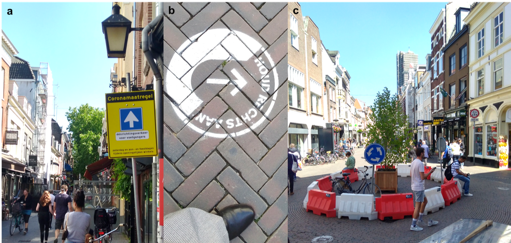

Project description:
> This project is funded by the Volkswagen Foundation and focuses on the question how the streetscape and potential interventions in it influence physical distancing compliance. The project team will develop and open source agent-based model of pedestrian physical distancing behavior, calibrate it with user experiments in an immersive virtual environment, and run it for various city streetscapes. The model may serve as a tool for planning and ex-ante evaluation of policy interventions in the streetscape targeting to minimize the spread of COVID-19 and other infectious diseases. The top half of the figure shows examples for streetscape interventions designed to prevent the spread of the COVID-19 disease in Utrecht, The Netherlands: a) pedestrian one-way street, b) sign asking to keep right, c) pedestrian roundabout, including examples of non-compliance. (image © Judith Verstegen). The bottom half depicts and overview of the study set-up consisting of an Agent-Based Model (ABM) of pedestrian behavior and an Immersive Video Environment (IVE).

---

Published articles:
- Stenkamp, J., Karic, B., Scharf, P., Verstegen, J.A. and Kray, C., 2023. Using an Immersive Video Environment to Assess Pedestrians’ Compliance With COVID Distance Keeping Interventions. Interacting with Computers, iwad021, https://doi.org/10.1093/iwc/iwad021
- Schröder, S., Stenkamp, J., Brüggemann, M., Karic, B., Verstegen, J.A. and Kray, C., 2023. Towards dynamically generating immersive video scenes for studying human-environment interactions. AGILE: GIScience Series, 4, p.40, https://doi.org/10.5194/agile-giss-4-40-2023
